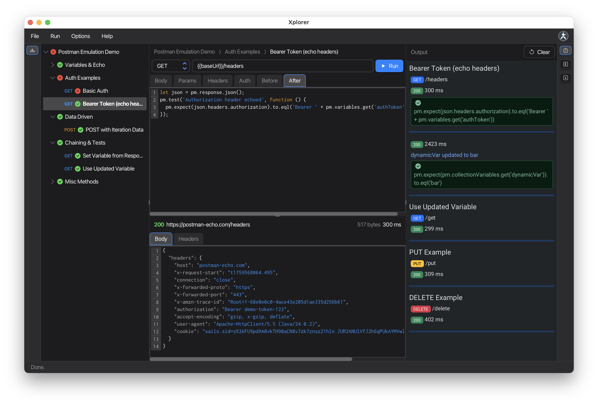

# Karate Xplorer

**The API Collection Runner Alternative**

Run your existing Postman collections locally. Zero migration. Zero hassle.

---

  

---

### [:globe_with_meridians: **Visit the Documentation Site**](https://karatelabs.github.io/xplorer)

**Everything you need is here:**
Installation • Quick Start • Features • User Guide

---

[:arrow_down: Download](https://github.com/karatelabs/xplorer/releases) •
[:tv: Watch Demo](https://youtu.be/3u0i-vdD0mg?si=9elNmYpLgEyROGJY) •
[:heavy_dollar_sign: Pricing](https://www.karatelabs.io/pricing) •
[:octocat: Report Issues](https://github.com/karatelabs/xplorer/issues)

